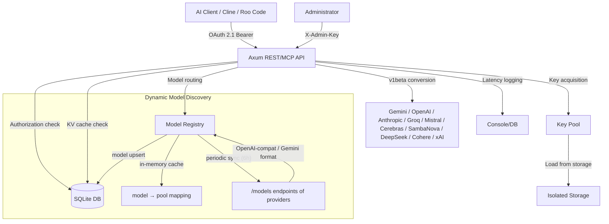

# Nexus API Balancer

[](https://opensource.org/licenses/Apache-2.0)
[](https://www.rust-lang.org/)
[](https://oauth.net/2.1/)
[](https://modelcontextprotocol.io/)
[](https://scalar.com/)
[](https://github.com/launchbadge/sqlx)

Nexus API Balancer is a high-performance proxy server and intelligent key balancer for various AI providers built on Rust. The system provides a Dynamic Model Registry (automatic model discovery via `/models` endpoints of providers), context caching capabilities, detailed latency logging, dynamic load balancing, and client isolation.

---

## System Architecture



---

## Key Features

- **High Concurrency**: Efficient async request pool management using `tokio` and `async-channel`.
- **Dynamic Model Registry**: Automatic discovery of available models via provider `/models` endpoints on startup and every 6 hours. Models are stored in SQLite with an in-memory cache for fast O(1) lookup.
- **Priority-based routing**: Pool priority (`priority` in config) determines which provider receives a request when a model is available from multiple providers.
- **Unified Routing Gateway**: Automatic request routing to the appropriate providers based on the dynamic model registry (with fallback to prefix-based heuristics).
- **Multi-Provider Support**: Built-in support for OpenAI, Google Gemini, Anthropic Claude, Groq, Mistral, Cerebras, Cohere, DeepSeek, xAI (Grok), and SambaNova.
- **Aggregated `/v1/models` Endpoint**: OpenAI-compatible endpoint returning all models available to the client from the registry.
- **Intelligent KV Cache**: Context cache management per pool with automatic endpoint transformation (e.g., for Google Gemini v1beta).
- **Multi-Key Secrets**: Ability to load multiple API keys from a single file (one key per line) with automatic unique identifier generation and rotation.
- **Client Isolation**: Secure key separation and client access restriction to assigned pools.
- **CORS Protection**: Configurable CORS policy via `cors_allowed_origin` config or `CORS_ALLOWED_ORIGIN` env var (default: `http://localhost:3317`).
- **MCP Protocol Support**: Full Model Context Protocol integration for dynamic pool discovery and administration.
- **Interactive Documentation**: Built-in interactive API specification via Scalar at `/scalar`.

---

## Deployment and Configuration Guide

### Step 1: Environment Setup

Create configuration and environment files from templates, along with a directory for storing secrets:

```bash
cp .env.example .env
cp config.yaml.example config.yaml
mkdir -p secrets
```

Configure parameters in the `.env` file (e.g., admin secrets, ports, and database connection settings).

### Step 2: Pool and Provider Configuration (`config.yaml`)

The `config.yaml` file defines the pool structure and request distribution rules. Each pool is tied to a specific provider.

Example pool structure with Model Registry fields:

```yaml
pools:
  - name: "openai-pool"
    description: "Main pool for requests to OpenAI-compatible APIs"
    provider: "openai"
    target_url: "https://api.openai.com"
    capacity: 20
    priority: 10                    # Pool priority (higher = preferred when models conflict)
    models_endpoint: "/models"      # Custom endpoint for model discovery (optional)
    skip_model_sync: false          # Disable auto-discovery for this pool
    keys:
      - id: "OPENAI_KEY_GROUP"
        secret_name: "openai_keys.txt" # Filename inside the secrets/ directory
        secret_type: "api_key"
        concurrency: 5 # Maximum concurrent requests per key
        rps_limit: 10 # Requests per second limit (RPS)
        tpm_limit: 60000 # Tokens per minute limit (TPM)
        max_request_tokens: 16000 # Maximum context size limit per request
        cooldown_on_limit: true # Send key to cooldown when limits are exceeded
```

**Model Registry Fields:**
- `priority` — integer. When models conflict (the same model available from multiple providers), the request is routed to the pool with the highest `priority`.
- `models_endpoint` — optional path to the provider's model list endpoint. Defaults to `/models`. For Google Gemini — `/models` (parsed separately).
- `skip_model_sync` — if `true`, the pool is excluded from model auto-discovery on startup and periodic sync.

### Step 3: Adding API Keys

Keys are stored in isolated text files within the `secrets/` directory. The balancer supports both single keys and key lists.

To add multiple keys for a pool (e.g., for `openai-pool` with `secret_name: "openai_keys.txt"`):

1. Create the file `secrets/openai_keys.txt`.
2. Enter your API keys, separated by newlines:

```text
sk-proj-11111111111111111111
sk-proj-22222222222222222222
sk-proj-33333333333333333333
```

The balancer automatically reads all keys from the file, registers them under unique names (`OPENAI_KEY_GROUP#1`, `OPENAI_KEY_GROUP#2`, etc.), and evenly distributes and rotates requests among them.

### Step 4: Running the Balancer

Run the project using Cargo:

```bash
cargo run
```

The balancer will start an HTTP server on the host and port specified in `config.yaml` (default `http://0.0.0.0:3317`).

---

## Client Connection (Cline, Roo Code, OpenCode)

The balancer provides a Unified Gateway at `http://localhost:3317/v1/chat/completions`, fully compatible with the OpenAI API standard. The balancer automatically parses the `model` field in the request and routes it to the appropriate provider pool.

Authorization uses a client token (JWT) generated during client registration, or a master token from the configuration.

### Configuration in Cline / Roo Code / Roo Cline

To integrate the balancer into VS Code extensions (e.g., Cline or Roo Code), follow these steps:

1. Open the model provider settings in the extension.
2. Select provider: **OpenAI Compatible**.
3. Specify connection parameters:
   - **Base URL (API URL)**: `http://localhost:3317`
   - **API Key**: Paste your client token (JWT) or master key (e.g., `nexus-master-key-2026`).
   - **Model ID**: Enter the desired model name.
4. Click the connect/save button.

### Configuration in OpenCode

**Method 1: OpenAI Compatible (default)**

1. Open the OpenCode extension settings.
2. Set the following values in configuration:
   - Endpoint URL: `http://localhost:3317`
   - Authorization token (API Key): `<your JWT client token>`
3. Select or specify a model. The balancer will automatically route based on the dynamic model registry:

   **Automatic Routing:**
   The model is resolved through the Dynamic Model Registry — on startup and every 6 hours, the balancer queries the `/models` endpoints of all providers and builds a `model → pool` mapping. If the model is found in the registry, the request is routed to the pool with the highest `priority`. If the model is not found, a prefix-based fallback is used.

   **Explicit Provider (`//provider//model`):**
   You can force a specific provider in the model name:
   - `//cerebras//llama-3.1-8b` — route to Cerebras
   - `//groq//llama-3.1-8b` — route to Groq
   - `//sambanova//llama-3.1-8b` — route to SambaNova
   - `//openai//gpt-4o` — route to OpenAI

   **Aggregated `/v1/models` Endpoint:**
   Allows clients to retrieve a list of all available models:
   ```bash
   curl http://localhost:3317/v1/models -H "Authorization: Bearer <token>"
   ```

**Method 2: Custom Provider**
In the "Custom Provider" section, you can configure direct endpoint access.

1. Enable the option: **Use custom API URL**.
2. In the **Custom API URL** field, enter: `http://localhost:3317/v1/chat/completions`
3. Enable the option: **Pass API key in custom call headers**.
4. In the **Custom call API key header name** field, enter: `Authorization`
5. In the **Custom call API key** field, enter the token with the Bearer prefix: `Bearer <your JWT client token>`

---

## MCP Configuration (Model Context Protocol)

Since Nexus Balancer primarily runs in Docker and exposes MCP as an HTTP endpoint at `/mcp`, to connect local clients expecting standard stdio MCP (such as Roo Code, OpenCode, LM Studio, or Cline), you need to use the built-in bridge adapter.

The `nexus_balancer` binary itself can operate in adapter mode, translating `stdio` requests from the local machine into HTTP POST requests to the balancer (running in Docker or on a remote host).

Make sure to set the correct server URL and authorization key via environment variables. By default, the adapter connects to `http://localhost:3317/mcp`.

### Configuration for Roo Code and OpenCode

Add the following block to the `mcp.json` file (usually located at `~/.config/roocode/mcp.json` or in the extension settings):

```json
{
  "mcpServers": {
    "nexus-balancer": {
      "command": "cargo",
      "args": [
        "run",
        "--manifest-path",
        "/path/to/nexus_balancer/Cargo.toml",
        "--",
        "mcp"
      ],
      "env": {
        "NEXUS_MCP_URL": "http://localhost:3317/mcp",
        "NEXUS_API_KEY": "<YOUR_API_KEY>"
      }
    }
  }
}
```
*(If you already have a compiled binary, you can use `command: "/path/to/nexus_balancer"` and `args: ["mcp"]` instead of `cargo run`)*

### Configuration for LM Studio

In LM Studio's MCP settings (section "Developer" -> "MCP"), add a similar configuration:

```json
{
  "mcpServers": {
    "nexus-balancer": {
      "command": "cargo",
      "args": [
        "run",
        "--quiet",
        "--manifest-path",
        "/path/to/nexus_balancer/Cargo.toml",
        "--",
        "mcp"
      ],
      "env": {
        "NEXUS_MCP_URL": "http://localhost:3317/mcp",
        "NEXUS_API_KEY": "<YOUR_API_KEY>"
      }
    }
  }
}
```

---

## Dynamic Model Registry

The balancer automatically discovers provider models through their `/models` endpoints.

### How It Works

1. **On startup**: for each pool (except `skip_model_sync: true`), an HTTP request is made to `{target_url}/models`.
2. **Response parsing**: OpenAI-compatible providers (`{data: [{id, owned_by, ...}]}`) and Google Gemini (`{models: [{name, inputTokenLimit, ...}]}`) are handled by different parsers.
3. **SQLite storage**: models are upserted into the `provider_models` table. Old records are marked `is_stale = 1` and deleted after 24 hours.
4. **In-memory cache**: after sync, a `HashMap<model_id, Vec<(pool_name, priority)>>` is built, sorted by `priority` DESC.
5. **Routing**: on request, `resolve_model(model_id)` returns the pool_name with the highest priority in O(1).
6. **Periodic sync**: every 6 hours, a background process updates the registry.

### Graceful degradation

If a provider's API is unavailable or the key is invalid — the sync skips that pool with a warning, without crashing the server. Models from the previous sync remain in the DB until stale cleanup (>24h).

## Diagnostics and Monitoring

On startup, a summary of discovered models is displayed:
```text
[ModelRegistry] Starting initial model discovery...
[ModelRegistry] Discovered 15 models from cerebras-pool
[ModelRegistry] Discovered 23 models from groq-pool
...
 Models:  47 discovered across 3 providers
```

Each proxied request is logged in real-time with precise latency measurements:

```text
[13:14:02.795] [DEBUG] Proxy: Processing request (Body size: 137060 bytes)
[13:14:12.264] [DEBUG] Proxy: Upstream status 200 OK, Acquire: 487.2µs, Total: 9.46s
```

- **Acquire**: Time spent obtaining a free key from the pool (typically less than 1 ms).
- **Total**: Total request processing time on the server from receipt to response delivery.

---

## Security and Administration

- **Authorization**: Access to the proxy server is only possible with a valid `Authorization: Bearer <token>` header.
- **Secret isolation**: All client key files are physically isolated at the filesystem level.
- **CORS**: Restricted to configured origin (default `http://localhost:3317`), configurable via `cors_allowed_origin` or `CORS_ALLOWED_ORIGIN` env var.
- **Path traversal protection**: All file paths are validated against `..` and absolute path components.
- **Interactive panel**: For testing and exploring all endpoints, use the Scalar documentation at `http://localhost:3317/scalar`.
- See [docs/SECURITY.md](docs/SECURITY.md) for a full security reference.

---

## License

This project is distributed under the Apache-2.0 license. See the [LICENSE](LICENSE) file for details.
