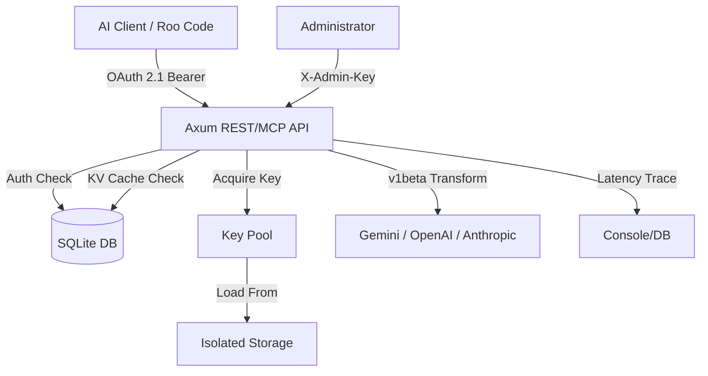

<div align="center">

# Nexus API Balancer

[](https://opensource.org/licenses/Apache-2.0)
[](https://www.rust-lang.org/)
[](https://oauth.net/2.1/)
[](https://modelcontextprotocol.io/)
[](https://scalar.com/)
[](https://github.com/launchbadge/sqlx)

**Rust-based high-performance proxy and intelligent key balancer for AI providers. Features context caching, detailed latency tracing, and client isolation.**  
_Secure, Scalable, and optimized for Large Language Models._

</div>

---

## 🚀 Key Features

- **High Concurrency**: Asynchronous pool management using `tokio` and `async-channel`.
- **Intelligent KV Cache**: Flexible Context Caching toggle per client-pool with automatic `v1beta` endpoint transformation for Google Gemini.
- **Detailed Latency Tracing**: High-precision logging of `Acquire` (key retrieval) and `Total` (upstream response) times with sub-millisecond timestamps.
- **Multi-Key Secrets**: Support for loading multiple API keys from a single file (one per line) with automatic unique ID generation (`#1`, `#2`, etc.).
- **Client-Isolated Storage**: Dynamic key partitioning ensures client secrets are stored in isolated directories (`secrets/<client_id>/`).
- **MCP Native**: Full Model Context Protocol support for dynamic pool discovery and administrative key management.
- **Observability**: Real-time debug logs with high-resolution timestamps and body size metrics for performance tuning.
- **Admin Protection**: Dedicated administrative layer secured via `.env` secrets and `X-Admin-Key` headers.
- **Interactive Documentation**: Premium API explorer via **Scalar** available at `/scalar`.

---

## 🏗️ Architecture



## 🛠️ Getting Started

### 1. Installation

```bash
cp .env.example .env
cp config.yaml.example config.yaml
mkdir -p secrets
```

### 2. Adding Keys

You can now add multiple keys to a single file:

```bash
# secrets/gemini_pool
AIzaSy...key_1
AIzaSy...key_2
AIzaSy...key_3
```

Nexus will automatically register these as `GEMINI_KEY#1`, `GEMINI_KEY#2`, etc., and rotate between them.

### 3. Running

```bash
cargo run
```

---

## 💎 KV Cache (Context Caching)

Nexus supports per-client KV Cache toggling. When enabled for a specific pool:

1. Requests are automatically routed to the `v1beta` endpoint (required for Gemini Context Caching).
2. The balancer prioritizes stability for long-context interactions.

**To enable via API:**

```json
POST /admin/keys/api-gemini-pool
{
  "key": { "id": "GEMINI_POOL", "concurrency": 5, ... },
  "secret": "...",
  "kv_cache": true
}
```

---

## 📊 Performance Diagnostics

Every request logs detailed timing info:
`[13:14:02.795] [DEBUG] Proxy: Processing request (Body size: 137060 bytes)`
`[13:14:12.264] [DEBUG] Proxy: Upstream status 200 OK, Acquire: 487.2µs, Total: 9.46s`

- **Acquire**: Time taken to retrieve a free key slot (should be <1ms unless pool is saturated).
- **Total**: Total time from request entry to the first byte of upstream response.

---

## 🛡️ Security

- **OAuth 2.1**: Bearer tokens are mandatory for all proxy calls.
- **Client Isolation**: Clients can only see and use pools explicitly assigned to them in the database.
- **Admin Bypass**: Administrators can use a master key to bypass standard limits for testing.

---

## 📖 API Documentation

Full interactive documentation is available at `http://localhost:3317/scalar` once the server is running.

## 📜 License

Apache-2.0. See [LICENSE](LICENSE).
