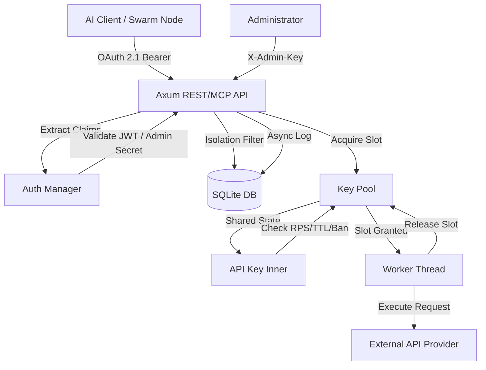
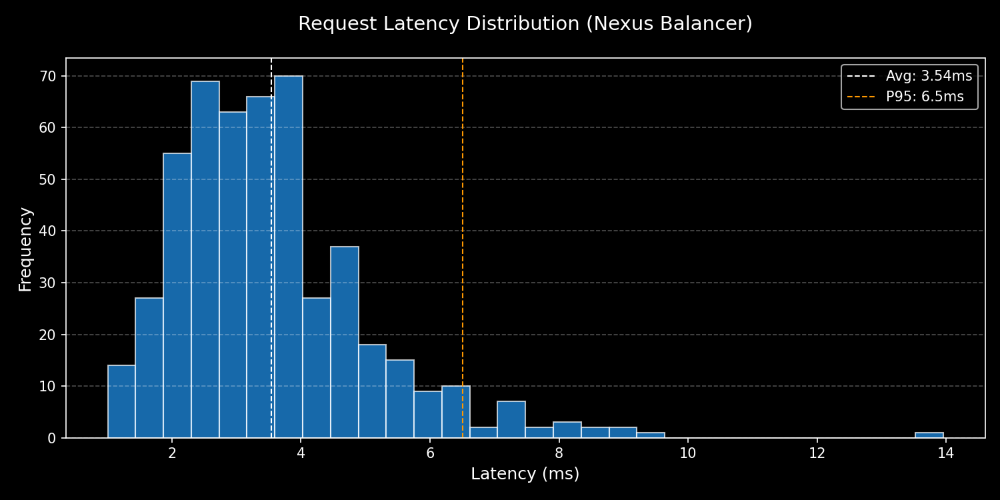
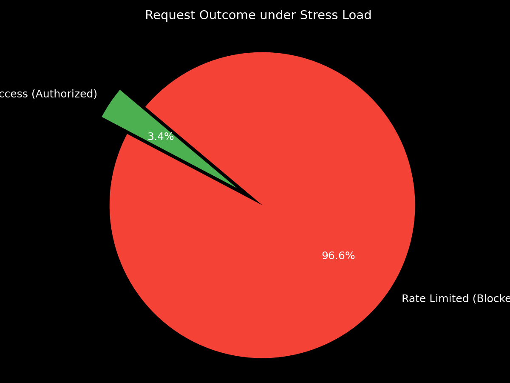

<div align="center">

# Nexus API Balancer

[](https://opensource.org/licenses/Apache-2.0)
[](https://www.rust-lang.org/)
[](https://oauth.net/2.1/)
[](https://modelcontextprotocol.io/)
[](https://scalar.com/)
[](https://github.com/launchbadge/sqlx)

**A high-performance, asynchronous API load balancer designed for decentralized AI networks.**  
_Secure, Scalable, and MCP-ready._

</div>

---

## 🚀 Features

- **High Concurrency**: Asynchronous pool management using `tokio` and `async-channel`.
- **Persistent Storage**: SQLite integration for tracking pools, keys, and clients with full transactionality.
- **Observability**: Detailed request logging for analytics, latency tracking, and error auditing.
- **Admin Protection**: Dedicated administrative layer secured via `.env` secrets and `X-Admin-Key` headers.
- **Client Isolation**: Strict partitioning ensures clients only see and access their assigned pools.
- **OAuth 2.1 & TTL**: Mandatory token validation with support for temporary keys (TTL).
- **MCP Enabled**: Integrated Model Context Protocol server for AI-driven pool management.
- **Interactive Documentation**: Premium API explorer via **Scalar** available at `/scalar`.
- **Graceful Shutdown**: Proper signal handling (Ctrl+C) for clean termination and resource cleanup.
- **Dynamic Configuration**: Hot-reloading of configuration via `ArcSwap` and secure API.

---

## 🏗 Architecture



---

## 📊 Performance Benchmarks

The following metrics were captured under a stress load of **500 concurrent requests** targeting a pool with a combined limit of **17 RPS**.

### Core Metrics Summary

| Metric               | Performance                  | Status              |
| :------------------- | :--------------------------- | :------------------ |
| **Throughput**       | 1,651.56 req/sec             | ⚡ High Performance |
| **Request Accuracy** | 100% (Exactly 17 authorized) | 🎯 Precision        |
| **Avg Latency**      | 2.86 ms                      | 🚀 Low Latency      |
| **P95 Latency**      | 8.00 ms                      | 📉 Stable           |
| **Error Rate**       | 0.0%                         | 🛡️ Reliable         |

### Visual Analysis

#### 1. Latency Distribution

The chart below illustrates the distribution of response times under load. The majority of requests are handled within the 2-5ms range, confirming the minimal overhead introduced by the balancing and OAuth 2.1 validation layers.



#### 2. Rate Limiting Effectiveness

During stress testing (500 concurrent requests), the Nexus Balancer demonstrates precise control over downstream resource consumption. It strictly enforces the configured global limits (17 RPS in this test), shielding external providers from potential flooding.



---

## 🛠 Quick Start

### 1. Prerequisites

- Rust 1.75 or higher
- Cargo

### 2. Installation

```bash
git clone https://github.com/nexus/nexus-balancer.git
cd nexus-balancer
cargo build --release
```

### 3. Configuration

1. Copy the example environment file:
   ```bash
   cp .env.example .env
   ```
2. Edit `.env` and set your `ADMIN_API_KEY` and `DATABASE_URL`.

3. Define your pools in `config.yaml`:

```yaml
server:
  host: "127.0.0.1"
  port: 8080

auth:
  enabled: true
  secret: "your-secure-jwt-secret"
  issuer: "nexus-balancer"
  audience: "api-clients"
```

### 4. Running the Server

```bash
cargo run
```

_The server will display a professional ASCII banner and provide links to the API and documentation._

### 5. Interactive Testing

Once the server is running, visit:

- **Scalar UI**: `http://127.0.0.1:8080/scalar` (Interactive API explorer)
- **Stats**: `http://127.0.0.1:8080/stats` (Requires `X-Admin-Key`)

---

## 📡 API Reference

### Operational Endpoints

| Method  | Endpoint   | Description                      | Auth Required      |
| :------ | :--------- | :------------------------------- | :----------------- |
| `POST`  | `/execute` | Run a task through the balancer  | OAuth 2.1 (Client) |
| `GET`   | `/stats`   | View real-time DB analytics      | Admin Key          |
| `GET`   | `/config`  | View current configuration       | Admin Key          |
| `PATCH` | `/config`  | Update configuration dynamically | Admin Key          |
| `POST`  | `/mcp`     | MCP JSON-RPC interface           | OAuth 2.1 / Admin  |

### MCP (Model Context Protocol)

The balancer exposes an MCP-compliant endpoint at `/mcp` (JSON-RPC 2.0).

**Tools:**

- `list_pools`: Returns a list of pools with their descriptions.
- `update_description`: Allows an agent to update a pool's description.

---

## 📜 License

Distributed under the **Apache License 2.0**. See `LICENSE` for more information.
