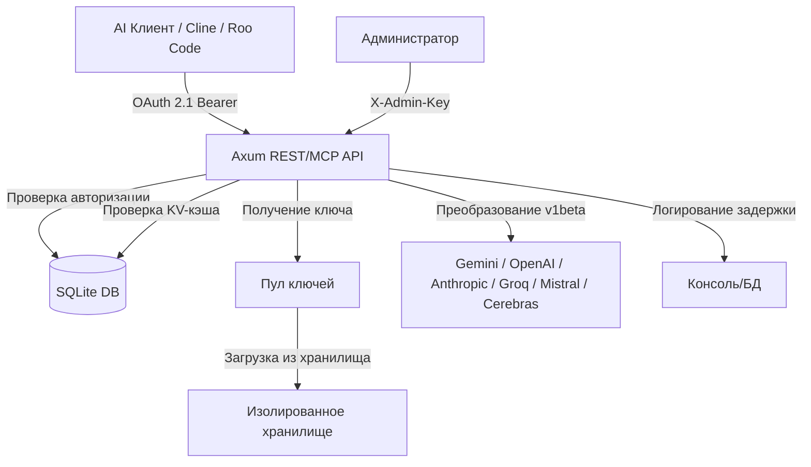

# Nexus API Balancer

[](https://opensource.org/licenses/Apache-2.0)
[](https://www.rust-lang.org/)
[](https://oauth.net/2.1/)
[](https://modelcontextprotocol.io/)
[](https://scalar.com/)
[](https://github.com/launchbadge/sqlx)

Nexus API Balancer — это высокопроизводительный прокси-сервер и интеллектуальный балансировщик ключей для различных AI-провайдеров на базе Rust. Система предоставляет возможности контекстного кэширования, детального логирования задержек, динамической балансировки нагрузки и изоляции клиентов.

---

## Архитектура системы



---

## Основные возможности

- **Высокая параллелизация**: Эффективное асинхронное управление пулами запросов с использованием `tokio` и `async-channel`.
- **Единый шлюз маршрутизации**: Автоматическое перенаправление запросов на нужных провайдеров на основе запрашиваемой модели.
- **Поддержка множества провайдеров**: Из коробки поддерживаются OpenAI, Google Gemini, Anthropic Claude, Groq, Mistral, Cerebras, Cohere, DeepSeek и xAI (Grok).
- **Интеллектуальный KV Cache**: Управление кэшем контекста для каждого пула с автоматической трансформацией эндпоинтов (например, для Google Gemini v1beta).
- **Мультиключевые секреты**: Возможность загрузки нескольких API-ключей из одного файла (по одному ключу на строку) с автоматической генерацией уникальных идентификаторов и ротацией между ними.
- **Изоляция клиентов**: Безопасное разделение ключей и ограничение доступа клиентов к назначенным пулам.
- **Поддержка протокола MCP**: Полная интеграция Model Context Protocol для динамического обнаружения пулов и администрирования.
- **Интерактивная документация**: Встроенная интерактивная спецификация API через Scalar по адресу `/scalar`.

---

## Руководство по развертыванию и настройке

### Шаг 1: Подготовка окружения

Создайте файлы конфигурации и окружения из шаблонов, а также директорию для хранения секретов:

```bash
cp .env.example .env
cp config.yaml.example config.yaml
mkdir -p secrets
```

Настройте параметры в файле `.env` (например, секреты администратора, порты и параметры подключения к БД).

### Шаг 2: Конфигурация пулов и провайдеров (`config.yaml`)

Файл `config.yaml` определяет структуру пулов и правила распределения запросов. Каждый пул привязывается к конкретному провайдеру.

Пример структуры пула:

```yaml
pools:
  - name: "openai-pool"
    description: "Основной пул для запросов к OpenAI совместимым API"
    provider: "openai"
    target_url: "https://api.openai.com"
    capacity: 20
    keys:
      - id: "OPENAI_KEY_GROUP"
        secret_name: "openai_keys.txt" # Имя файла внутри директории secrets/
        secret_type: "api_key"
        concurrency: 5 # Максимальное количество параллельных запросов на один ключ
        rps_limit: 10 # Лимит запросов в секунду (RPS)
        tpm_limit: 60000 # Лимит токенов в минуту (TPM)
        max_request_tokens: 16000 # Ограничение на максимальный размер контекста одного запроса
        cooldown_on_limit: true # Отправлять ключ на "остывание" при превышении лимитов
```

### Шаг 3: Добавление API-ключей

Ключи хранятся в изолированных текстовых файлах в директории `secrets/`. Балансировщик поддерживает как одиночные ключи, так и списки ключей.

Чтобы добавить несколько ключей для пула (например, для `openai-pool`, у которого указан `secret_name: "openai_keys.txt"`):

1. Создайте файл `secrets/openai_keys.txt`.
2. Впишите ваши API-ключи, разделяя их переносом строки:

```text
sk-proj-11111111111111111111
sk-proj-22222222222222222222
sk-proj-33333333333333333333
```

Балансировщик автоматически считает все ключи из файла, зарегистрирует их под уникальными именами (`OPENAI_KEY_GROUP#1`, `OPENAI_KEY_GROUP#2` и т. д.) и будет равномерно распределять и ротировать запросы между ними.

### Шаг 4: Запуск балансировщика

Запустите проект с помощью Cargo:

```bash
cargo run
```

Балансировщик запустит HTTP-сервер на хосте и порту, указанных в `config.yaml` (по умолчанию `http://0.0.0.0:3317`).

---

## Подключение к клиентам (Cline, Roo Code, OpenCode)

Балансировщик предоставляет единую точку доступа (Unified Gateway) по адресу `http://localhost:3317/v1/chat/completions`, которая полностью совместима со стандартом OpenAI API. Балансировщик автоматически анализирует поле `model` в запросе и направляет его в нужный пул провайдера.

При авторизации используется токен клиента (JWT), сгенерированный при регистрации клиента, либо мастер-токен из конфигурации.

### Настройка в Cline / Roo Code / Roo Cline

Для интеграции балансировщика в расширения VS Code (например, Cline или Roo Code) выполните следующие шаги:

1. Откройте настройки провайдера моделей в расширении.
2. Выберите провайдер: **OpenAI Compatible**.
3. Укажите параметры подключения:
   - **Base URL (API URL)**: `http://localhost:3317`
   - **API Key**: Вставьте ваш токен клиента (JWT) или мастер-ключ (например, `nexus-master-key-2026`).
   - **Model ID**: Введите имя желаемой модели.
4. Нажмите кнопку подключения/сохранения.

### Настройка в OpenCode

1. Откройте настройки расширения OpenCode.
2. Установите следующие значения в конфигурации:
   - URL эндпоинта: `http://localhost:3317`
   - Токен авторизации (API Key): `<ваш JWT токен клиента>`
3. Выберите или укажите модель. Балансировщик автоматически выполнит маршрутизацию:
   - Запросы к моделям `gpt-4`, `gpt-5`, и другие - пойдут на пулы OpenAI.
   - Запросы к моделям `claude-4-6-sonnet`, `claude-4.7-opus` пойдут на пулы Anthropic.
   - Запросы к моделям `gemini-3.1-pro`, `gemini-3.5-flash` пойдут на пулы Google Gemini.
   - Запросы к моделям `mistral-large`, `codestral` пойдут на пулы Mistral.
   - Запросы к моделям `llama-3.1`, `gpt-oss-120b` пойдут на пулы Groq или Cerebras.

---

## Диагностика и мониторинг

Каждый проксируемый запрос логируется в режиме реального времени с указанием точных задержек:

```text
[13:14:02.795] [DEBUG] Proxy: Processing request (Body size: 137060 bytes)
[13:14:12.264] [DEBUG] Proxy: Upstream status 200 OK, Acquire: 487.2µs, Total: 9.46s
```

- **Acquire**: Время, затраченное на получение свободного ключа из пула (обычно менее 1 мс).
- **Total**: Полное время обработки запроса сервером от момента его получения до отправки ответа клиенту.

---

## Безопасность и администрирование

- **Авторизация**: Доступ к прокси-серверу возможен только при наличии валидного заголовка `Authorization: Bearer <token>`.
- **Изоляция секретов**: Все файлы ключей клиентов физически изолированы на уровне файловой системы.
- **Интерактивная панель**: Для тестирования и ознакомления со всеми эндпоинтами используйте Scalar-документацию по адресу `http://localhost:3317/scalar`.

---

## Лицензия

Проект распространяется под лицензией Apache-2.0. Подробности смотрите в файле [LICENSE](LICENSE).