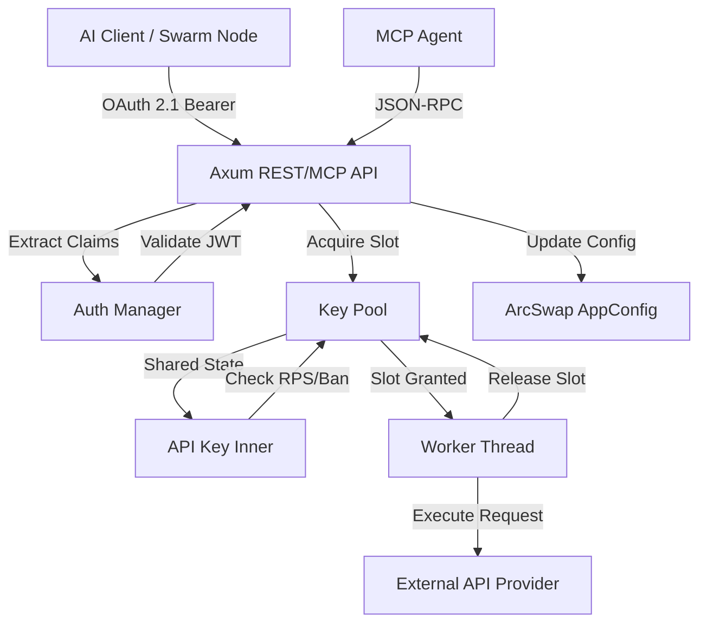

<div align="center">

# Nexus API Balancer

[](https://opensource.org/licenses/Apache-2.0)
[](https://www.rust-lang.org/)
[](https://oauth.net/2.1/)

**A high-performance, asynchronous API load balancer designed for decentralized AI networks.**  
*Secure, Scalable, and MCP-ready.*

</div>

---

## 🚀 Features

- **High Concurrency**: Asynchronous pool management using `tokio` and `async-channel`.
- **Global Rate Limiting**: Shared thread-safe state via `Arc<Mutex>` ensures strict RPS limits across all workers.
- **OAuth 2.1 Protected**: Mandatory Bearer token validation for all administrative and operational endpoints.
- **MCP Enabled**: Integrated Model Context Protocol server allowing AI agents to manage pools and descriptions dynamically.
- **Dynamic Configuration**: Hot-reloading of configuration parameters via `ArcSwap` and REST/MCP API.
- **Secure Storage**: Externalized secrets management with support for multiple key types and individual settings.

---

## 🏗 Architecture



---

## 📊 Performance Benchmarks

The following metrics were captured under a stress load of **500 concurrent requests** targeting a pool with a combined limit of **17 RPS**.

### Core Metrics Summary

| Metric | Performance | Status |
| :--- | :--- | :--- |
| **Throughput** | 1,651.56 req/sec | ⚡ High Performance |
| **Request Accuracy** | 100% (Exactly 17 authorized) | 🎯 Precision |
| **Avg Latency** | 2.86 ms | 🚀 Low Latency |
| **P95 Latency** | 8.00 ms | 📉 Stable |
| **Error Rate** | 0.0% | 🛡️ Reliable |

### Visual Analysis

#### 1. Latency Distribution
The chart below illustrates the distribution of response times under load. The majority of requests are handled within the 2-5ms range, confirming the minimal overhead introduced by the balancing and OAuth 2.1 validation layers.


#### 2. Rate Limiting Effectiveness
During stress testing (500 concurrent requests), the Nexus Balancer demonstrates precise control over downstream resource consumption. It strictly enforces the configured global limits (17 RPS in this test), shielding external providers from potential flooding.


---

## 🛠 Quick Start

### 1. Prerequisites
- Rust 1.75 or higher
- Cargo

### 2. Installation
```bash
git clone https://github.com/nexus/nexus-balancer.git
cd nexus-balancer
cargo build --release
```

### 3. Configuration
Define your pools and security settings in `config.yaml`:
```yaml
server:
  host: "127.0.0.1"
  port: 8080

auth:
  enabled: true
  secret: "your-secure-jwt-secret"
  issuer: "nexus-balancer"
  audience: "api-clients"

pools:
  - name: "primary"
    description: "Main search pool for high-priority AI queries"
    capacity: 20
    keys:
      - id: "ORG_A_Tier_1"
        limit: 10
        concurrency: 5
        secret_name: "org_a_api_key"
        secret_type: "api_key"
```

### 4. Running the Server
```bash
cargo run
```

---

## 📡 API Reference

### Operational Endpoints

| Method | Endpoint | Description | Auth Required |
| :--- | :--- | :--- | :--- |
| `POST` | `/execute` | Run a task through the balancer | OAuth 2.1 |
| `GET` | `/stats` | View current pool health | OAuth 2.1 |
| `GET` | `/config` | View current configuration | OAuth 2.1 |
| `PATCH` | `/config` | Update configuration dynamically | OAuth 2.1 |

### MCP (Model Context Protocol)

The balancer exposes an MCP-compliant endpoint at `/mcp` (JSON-RPC 2.0).

**Tools:**
- `list_pools`: Returns a list of pools with their descriptions.
- `update_description`: Allows an agent to update a pool's description.

---

## 📜 License

Distributed under the **Apache License 2.0**. See `LICENSE` for more information.
